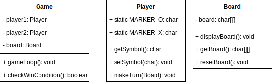

**Draw the UML of each core class and explain your design.**

**How does your design reflect the encapsulation principle?**

The Board class encapsulates the board data of the game and the logic to display the board and retrieve the board and thus uses encapsulation principle. The Player class encapsulates its symbol data and the logic to access and mutate the symbol and the logic to make its turn on the Board given a Board class. The Game class encapsulates the 2 players required for the game as well as the Board needed for the game and the logic for a game loop and the logic for the win conditions. Thus my desgin reflects the encapsulation principle.

**How does the game flow reflect good design principles?**

It uses chain of responsibility and divide and conquer principle to separate the game flow into smaller sub problems which can be grouped together into separate classes. For example, things related to the actions and attributes of the Player (marker, making a move) stay in the Player class. Things regarding the Board (display the board, checking validity of move, claiming square, getting cells at row and column) stay in the Board class. Things regarding the game itself (like the game logic, game loop, checking for the winner and the end) stay in the Game class. By using these principles, not only will we be able to split large problems into smaller sub problems, but we will also be able to narrow down the cause of a bug/error in our program down to a particular class or method which is responsible for implementing that section.

**What challenges did you face in handling user input?**

The challenges I faced with handling user input was with regards to where should I initialize the Scanner (method level, top level, global) and how I should prompt the user and validate their response. I solved the first part by initializing the Scanner as a static element of the Player since it is only the Player at the moment accessing the user input but it is subject to change. I solved the second part by realizing that the Player class contains the symbol so whenever I would nee dot prompt them, I just need to add the player symbol in the prompt to identify the turn of the player. For the third problem, I created a isValidMove method in the Board class where from the Board I can check if the cell attempted to be claimed already has been claimed. So I will continue to get their choices until their choice is valid.

